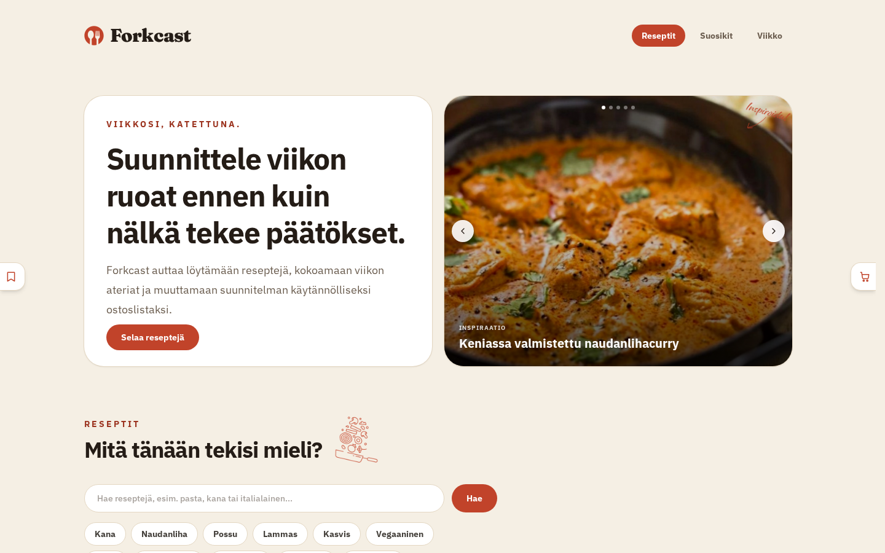
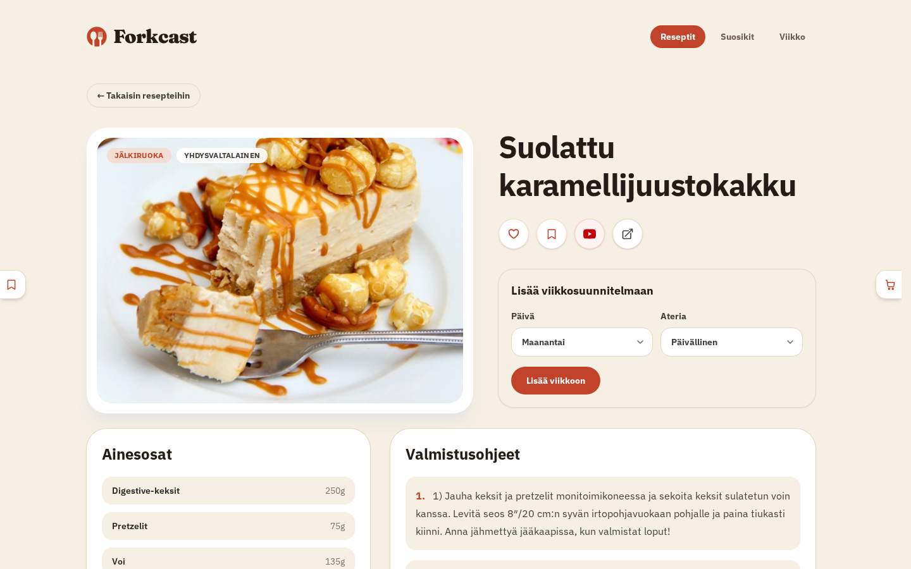
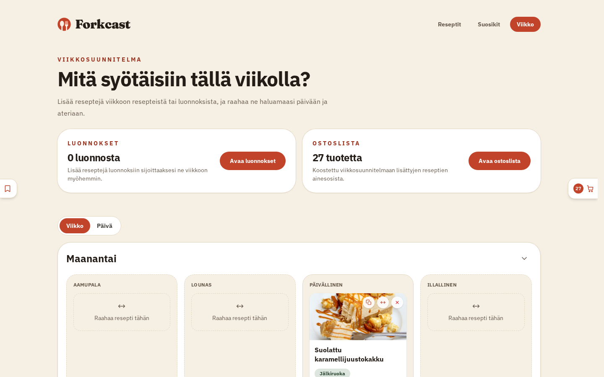

# Forkcast

**Forkcast — Viikkosi, katettuna.**

Forkcast on viikkosuunnitteluun tarkoitettu resepti- ja ateriasuunnittelusovellus. Sovelluksessa voi hakea reseptejä, tallentaa suosikkeja, suunnitella viikon ateriat ja muodostaa ostoslistan suunniteltujen reseptien aineksista.

**[Kokeile sovellusta täällä →](https://forkcast.kekola.fi)**

## Kuvakaappaukset

| Etusivu | Reseptin tiedot | Viikkosuunnitelma |
| --- | --- | --- |
|  |  |  |

## Ominaisuudet

- 790 reseptiä, kokonaan suomeksi (otsikot, ohjeet, ainesosat ja mittayksiköt)
- Vapaa tekstihaku reseptin nimellä sekä suomenkieliset pikahaut/hakusanat
- Kategoriapohjainen suodatus (esim. "Kana" + "Pasta"), joka perustuu reseptin oikeisiin ainesosiin, ei vain otsikkoon
- Reseptin tarkempi näkymä ponnahdusikkunana tai omalla sivullaan, aineksilla ja valmistusohjeilla
- Reseptien tallentaminen suosikkeihin
- Reseptien lisääminen luonnoksiin ja sieltä raahaaminen viikkosuunnitelman päivälle/aterialle
- Viikko- ja päivänäkymä suunnitelmalle, sekä koko viikon tai yksittäisen päivän tyhjennys
- Ostoslistan muodostaminen suunnitelluista resepteistä, ryhmiteltynä kategorioihin (proteiinit, maitotuotteet, jne.)
- Ostoslistan kopiointi leikepöydälle ja lataus tiedostona
- Ostoslistan tuotteiden merkitseminen tehdyksi
- Suosikkien, viikkosuunnitelman ja ostoslistan tila tallennettuna Supabaseen, sidottuna selaimen anonyymiin kirjautumiseen
- Satunnainen resepti inspiraatiokortista

## Teknologiat

- Nuxt 4
- Vue 3
- TypeScript
- Tailwind CSS
- Pinia
- Supabase (Postgres-tietokanta, autentikointi, reaaliaikainen REST-rajapinta)
- Vitest + Vue Test Utils
- ESLint

## Arkkitehtuuri

Koodi on jaoteltu vastuualueittain, jotta sivut pysyvät kevyinä ja logiikka on testattavissa erillään käyttöliittymästä:

- `app/composables/` — `useRecipesApi` kokoaa kaiken reseptihaun ja -yksityiskohdat yhteen paikkaan; `useRecipeModal` ja `useBodyScrollLock` jaettua ponnahdusikkunalogiikkaa; `useCurrentUserId` anonyymin käyttäjän tunnisteen hakuun
- `app/types/` — jaetut TypeScript-tyypit sekä Supabasen tietokantaskeemalle (`database.types.ts`) että sovelluksen omalle näyttömallille (`recipe.ts`)
- `app/stores/` — Pinia-storet (`favorites`, `planner`, `recipeModal`), jotka sisältävät myös niistä johdetun tilan, kuten ostoslistan kokoamisen
- `app/plugins/` — anonyymi Supabase-kirjautuminen, ponnahdusikkunan selainhistoria-integraatio ja kosketuslaitteiden raahaustuki
- `supabase/migrations/` — tietokantaskeema: reseptit, suosikit, viikkosuunnitelma, kategoriapohjainen haku ja suomenkielinen tekstihaku
- `test/` — Vitest-testit puhtaalle logiikalle (käännökset, ostoslistan koostaminen, storet) ja Vue Test Utils -komponenttitestit keskeisimmille käyttöliittymäosille

## Käyttöönotto

Asenna riippuvuudet:

```bash
npm install
```

Kopioi `.env.example` tiedostoksi `.env` ja täytä oman Supabase-projektisi osoite ja anon-avain (Project Settings → API):

```bash
cp .env.example .env
```

Käynnistä kehityspalvelin:

```bash
npm run dev
```

Sovellus on nyt käytettävissä osoitteessa `http://localhost:3000`.

### Testaus ja koodin laatu

```bash
npm run lint    # ESLint
npm run test    # Vitest
```

### Tietokanta

Reseptit, suosikit, viikkosuunnitelma ja ostoslistan tila ovat Supabase-tietokannassa. Skeema ja siihen tehdyt muutokset löytyvät numeroituina tiedostoina hakemistosta `supabase/migrations/` — ne ajetaan järjestyksessä Supabasen SQL-editorista. Alkuperäinen reseptidata on tuotu kertaluontoisesti [TheMealDB](https://www.themealdb.com/api.php) -rajapinnasta ja käännetty suomeksi; sovellus itse ei enää kutsu TheMealDB:tä ajonaikaisesti.